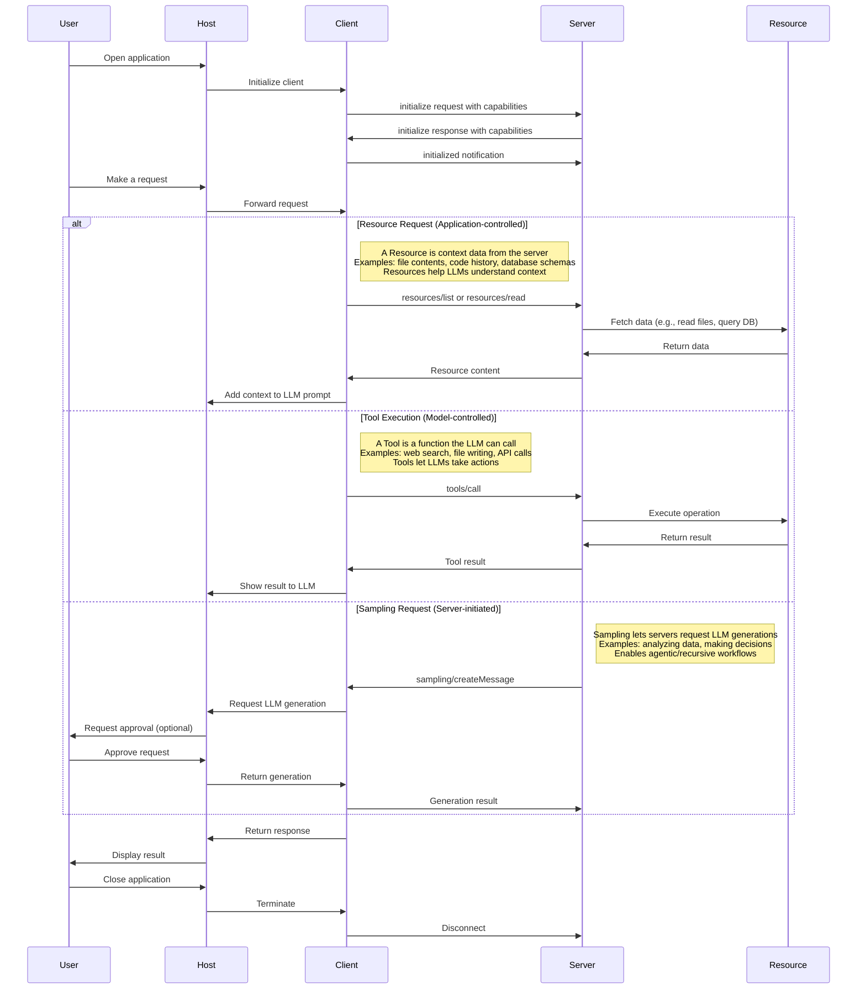
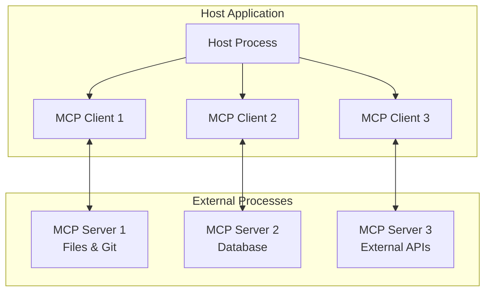

---
category:
  - study
type:
  - software development
topic:
  - ai
  - mcp
about: 
date: 2025-05-01
tags:
  - software
  - ai
  - study
---
#### reference
- https://modelcontextprotocol.io/introduction
- https://docs.anthropic.com/en/docs/agents-and-tools/mcp

- [MCP써야 진짜 Claude다! 500% 활용 튜토리얼 (개념부터 활용까지)](https://www.youtube.com/watch?v=fkqXQOjj8cA)
	- [MCP로 진짜 비서 된 Claude! 로컬 정리 + 드라이브 자동화 (코드 무료 제공)](https://www.youtube.com/watch?v=Pt1tEBCLiCc)
- [MCP by JoCoding](https://youtu.be/46HxP7kO9oY?si=QTmY6u5GDj8ZtJlo)
- [피그마 MCP로 디자인 딸깍 가능?](https://youtu.be/H-yo6dzJ13g?si=QeFIv6FtJi8Vrzx5)
	- [프롬프트로 피그마 디자인 만드는 mcp(cursor-talk-to-figma-mcp)](https://www.figma.com/community/plugin/1485687494525374295/cursor-talk-to-figma-mcp-plugin)
	- [피그마 디자인을 실제 코드로 만드는 mcp(Figma-Context-MCP)](https://github.com/GLips/Figma-Context-MCP)
- [MCP vs API: Simplifying AI Agent Integration with External Data by IBM Technology](https://www.youtube.com/watch?v=7j1t3UZA1TY)
- [Why You Need To Learn About MCP Right Now (Urgent!)  by Nomad Coder](https://www.youtube.com/watch?v=EswVjHZMn74)

- [Task Master MCP](https://www.youtube.com/watch?v=ktr-4JjDsU0)

##### media
- [모르면 실시간 손해? MCP, 딥시크 속도로 빠르게 확산 | 무료 AI 앱 폭발하게 된 MCP, 클로드 커서ai 동반 폭등 | 진짜 에이전트AI 시대 | 샘알트먼 급하게 지원 약속  by 안될공학](https://www.youtube.com/watch?v=Qdu6Sv-NpeU)
- 

# Body
### Difference between [[API(Application Programming Interface)]] and MCP
- https://apidog.com/kr/blog/mcp-vs-api-kr/
- https://medium.com/archetypical-software/%EF%B8%8F-breaking-down-mcp-vs-api-a-friendly-guide-to-software-architecture-c4ad55df1fd5
- https://apidog.com/blog/mcp-vs-api/

#### Services that I set up 
- Slack
- Figma
- Firecrawl
- Notion
- Linear
- Puppeteer

- Github
- Cloudflare
- Superbase

- [Task Master](https://www.youtube.com/watch?v=ktr-4JjDsU0)

예전에 카톡에서 매일매일 오늘의 뉴스 뭐 이런거 뿌려주던게 이 기술이였구나 싶다. MCP 이전에, 이미 **Langchain**이라는 기술이 구현을 할 수 있도록 했다. 하지만 MCP는 그 허들을 낮추면서 대중화에 일조하게 되었다.