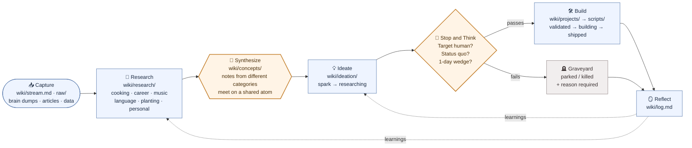

# Index

A personal vault for researching whatever I'm curious about — the AI industry and job market, cooking, music, language, planting, endurance sport — and letting that research turn into ideas, projects, and writing.

Everything moves through one loop:

**Capture → Research → Synthesize → Ideate → Build → Reflect ↺**

**Reading it:** research accumulates as notes; [Concepts](concepts/index.md) are the **synthesis stage** where notes from different categories collide and become ideas — this is where cross-domain insight (의외의 연결성) is produced deliberately instead of by memory. Ideas must pass a *Stop & Think* gate before code. Nothing dead-ends: what's built **and** what's killed both feed learnings back into research and ideation, closing the loop.

See [../LINKING.md](../LINKING.md) for how pages connect, and [../AGENTS.md](../AGENTS.md) for the full working manual.

---

## Capture

- [Stream](stream.md) — a log of messy thoughts: random, diary, idea, blame, question. Dump first, connect later.
- `raw/` — scraped datasets and source material.

## Research

Fact-gathering and deep dives, organized by category. Career is one category among the rest — its purpose is to understand the AI/startup landscape and find the right company and role.

- **AI industry & career** — [AI-Industry-Map-2026](research/system/AI-Industry-Map-2026.md) (agentic · physical · vertical AI), regional maps via [Global-AI-Index](research/career/Global-AI-Index.md), and strategy in [Application-Strategy-2026](research/career/Application-Strategy-2026.md) · [Job-Search-Status-2026](research/career/Job-Search-Status-2026.md) · [Product-Management-0-to-1](research/career/Product-Management-0-to-1.md). Platforms: [Wanted](https://www.wanted.co.kr/), [Remember](https://remember.co.kr/), [Jumpit](https://www.jumpit.co.kr/).
- **Cooking** — [Culinary Index](research/cooking/index.md) · [Selected Restaurants](research/cooking/selected-restaurants.md)
- **Music** — [Music Research Index](research/music/index.md)
- **Language** — [Language Research Index](research/language/index.md)
- **Planting** — [Planting & Horticulture Index](research/planting/index.md)
- **Travel** — [Travel Research Index](research/travel/index.md)
- **Vibecoding** — [Vibecoding Index](research/vibecoding/index.md)
- **Personal** — [Personal Reflections Index](research/personal/index.md)
- **Resume** — [Resume & Narrative References](research/resume/references.md)

## Ideation

- [Ideation Board](ideation/ideation.md) — active and backlog ideas with status.
- [Concept Index](concepts/index.md) — the reusable atoms that link ideas across categories.

## Projects

- [Michelin Filter](projects/Michelin Filter.md) — reasonable fine dining, filtered from global + local signals.
- [Personal Blog & Portfolio](projects/Personal Blog & Portfolio.md) — the "PM + Composer" site.
- [AI & Agentic Workflows](projects/AI & Agentic Workflows.md)
- [AI in Education — Side Effects](projects/AI in Education - Side Effects.md)

## System

- [Log](log.md) — change history and prompt log.
- [Concept Index](concepts/index.md) · [Linking Standard](../LINKING.md) · [Working Manual](../AGENTS.md)

## 🔗 Connections
- [[log|System Log]]
- [[concepts/index|Concept Index]]
- [[llm-wiki-pattern|Wiki Design Pattern]]
