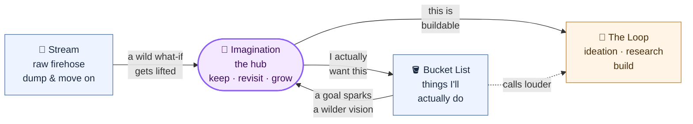

> [!IMPORTANT] Key Takeaway
> **Why this matters:** Some thoughts aren't tasks or plans — they're *what-ifs*. Wild, useless, beautiful. They deserve a home where they're kept and revisited, not processed and discarded.
> **How to use it:** Dump the daydream. No obligation to make it real. When one starts calling louder, it either becomes a **commitment** (→ Bucket List) or turns **buildable** (→ graduates into ideation/research). That's the loop.
> **Informs:** [[Bucket List]], the [[../../ideation/ideation|Ideation Board]], and research directions across every category.

# 💫 Imagination

The **hub** of a small three-page loop. This is where speculative thought lives — the "wouldn't it be wild if…" ideas that don't fit the firehose and aren't quite commitments yet.

**Reading it:** [[../../stream|Stream]] is the river — you dump everything there. The wildest what-ifs get *lifted* here into Imagination and kept. From the hub each daydream has two exits: it becomes a **[[Bucket List]]** item (I actually want to do this), or it turns **buildable** and graduates into the main loop ([[../../ideation/ideation|ideation]] / research). Bucket-list goals can flow back in when one sparks a wilder vision. Imagination is the standard everything routes through.

**Status:** 🌱 raw · 🔗 kept & revisited · 🪣 → Bucket List · 🎓 graduated to the loop — nothing is ever deleted.

---

## 🌌 What if… (speculative & sci-fi)
*The impossible, the absurd, the "physics doesn't allow it but imagine anyway."*
-

## 🏙️ Worlds & Futures
*Cities, societies, ways of living that don't exist yet.*
-

## 🧬 Self & Being
*Who I could become, alternate lives, powers I'd want, the person in the daydream.*
- Part of why I want to become known and well-regarded: reputation opens the door to meeting the people I admire — 윤여정, 정세주 (CEO of Noom), Peter Thiel, Mark Zuckerberg, Alexandr Wang. Becoming someone they'd want to meet back. 🌱

## 🎨 Creative & Aesthetic
*Art, music, stories, and things I'd love to make exist.*
- Traveling somewhere and connecting with locals through the things I love — busking, joining an orchestra or playing piano, cooking together. Language barriers dissolve; music and food become the shared tongue. 🌱

## 🔮 Long-shots
*"Impossible" goals worth wanting anyway — the Berlin Philharmonic kind.*
-

---
*Dump freely. When a daydream pulls you in, promote it — to [[Bucket List]] if you'll chase it, or into [[../../ideation/ideation|ideation]] if it's buildable — and link it back here.*

## 🔗 Connections

### 🔁 The Loop
- Lifted from → [[../../stream|Stream]] — the raw firehose upstream
- Becomes → [[Bucket List]] — when a what-if turns into a commitment
- Graduates → [[../../ideation/ideation|Ideation Board]] — when a what-if turns buildable

### ⬆ Pipeline
- Related → [[Dreams & Hobbies]] — the interests that feed the daydreams
- Hub → [[Personal Insights & Reflections|Personal Hub]] · [[../../index|Master Index]]
